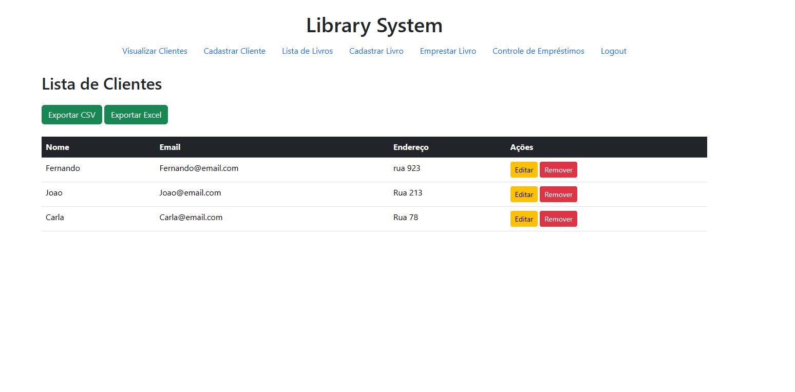

# Sitema de biblioteca

## Sobre

Este projeto foi desenvolvido com o objetivo de aprimorar minhas habilidades em Django, além de fornecer um sistema de biblioteca simples que serve como um excelente projeto prático para iniciantes. A ideia é oferecer uma base sólida para quem deseja criar seus primeiros projetos reais, explorando funcionalidades essenciais de um sistema de gerenciamento típico.

## Layout

## Tecnologias Usadas

- Python
- Django
- JavaScript (opcional)
- HTML
- CSS

## Como usar

1. Clone o repositório:

https://github.com/LucasSobrinh0/library_system

2. Instale as dependências:

pip install -r requirements.txt

3. Instale as dependências:

python manage.py makemigrations

python manage.py migrate

4. Crie um super usuário para usar a aplicação:

python manage.py createsuperuser

5. Rode o servidor:

python manage.py runserver

## Autor

Lucas Sobrinho Carneiro

Linkedin: https://www.linkedin.com/in/lucas-sobrinho-c-b9b6661b9/

Email: lucas.sobrinho.crn@gmail.com
